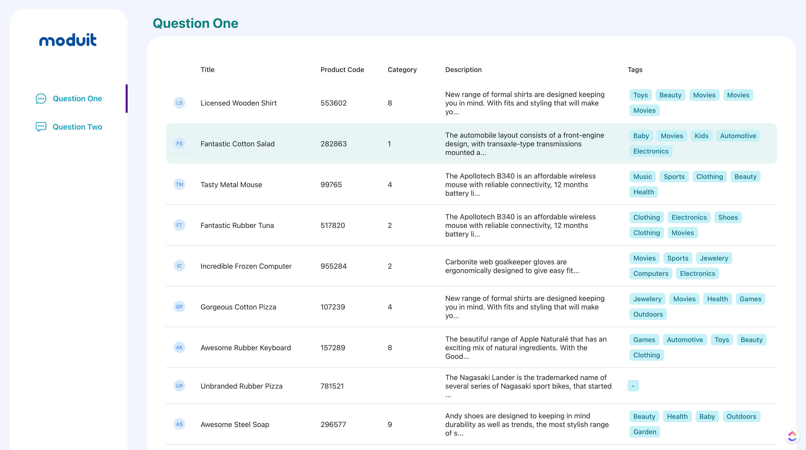
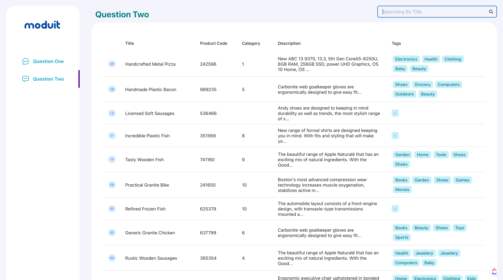

# Moduit FE React Coding Test.


NOTE: 
I m sorry for not using Next Js, Im on Working to design my own Next Js boilerplate, and im not finish it yet, so for this test i decide to use my React CRA boilerplate template rather than Next Js. 

dont forget to run 
```
cp webcon.js node_modules/react-scripts/config/webpack.config.js
```
Before ```yarn start``` or ```yarn build```

Question One


Question Two



